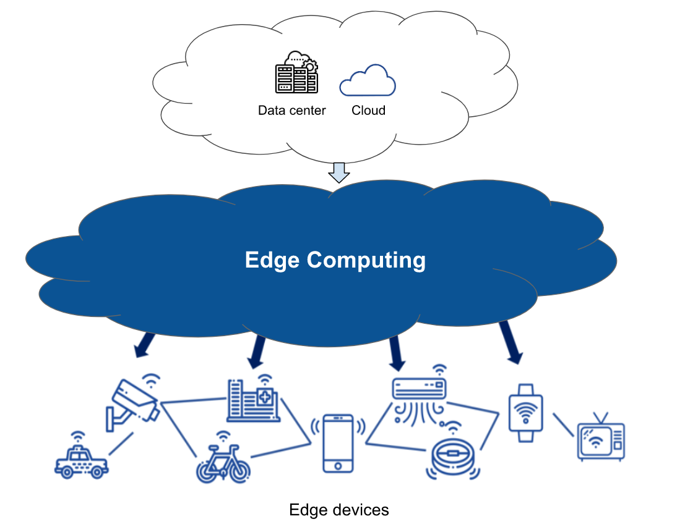
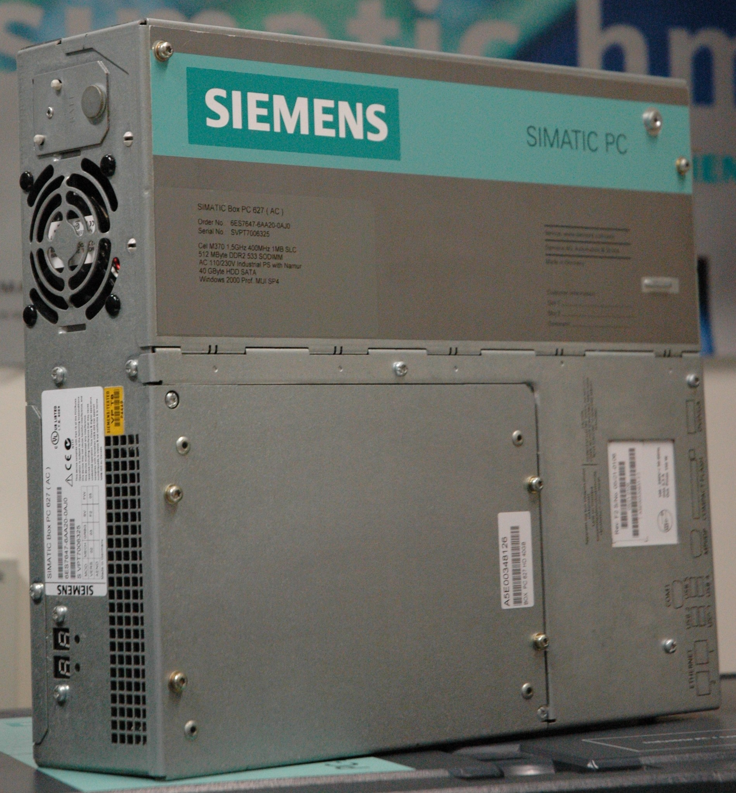

# Robotic Hardware Systems
## Weekly Activities 1: Robotic Hardware (3-CONTROLLER)

**Controllers** are hardware parts or devices designed to provide instructions and control motion in robotic systems. They are the components programmed to perform a set of desired tasks and functions based on digital algorithms. Due to application variations, controllers have been designed to fit specific criteria that allow them to perform more efficiently and effectively according to the intended application.

### Edge AI Controller
Artificial intelligence (AI) applications require controllers that are able to process edge computations and allow for efficient data transmission from and to edge devices, normally by using PC computers or single-board computers.

This type of controllers are commonly used for surveilance and in autonomous vehicles. For instance, self-driving cars use Edge AI controllers to process and analyse images of their surroundings and decide on the actions that need to be taken to avoid accidents.

**Examples of Edge AI controllers:**

* NVIDIA Jetson AGX Xavier
* NVIDIA Jetson Xavier
* NVIDIA Jetson Nano
* UP2 Squared board
* Coral dev board
* Raspberry Pi

### Industrial PC (IPC)
Industial PCs (IPC) are computers that are designed and constructed based on industrial standards, such as robustness, reliability, redundancy and high quality materials. This type of controllors are mainly used in Manufacturing, Data collection and storage, and SCADA systems.

**Examples of IPCs:** 

* ABB OmniCore C
* OMRON NYB
* SIEMENS SIMATIC IPC477E

### PLC
Programmable logic controller (PLC) are industrial controllers used in electro-mechanical applications. This type of controllers are designed to perform certain functions such as logic instructions, counting and timing. PLCs are particularly useful because of their flexibility, programming simplicity and their ability to perform repetitive tasks effectively.

Nowadays, PLCs are commonly used in several applications, such as conveyor belt systems, water tank quenching systems and traffic light systems.

**Examples of PLC:** 

* SIEMENS SIMATIC S7-1200
* OMRON NX7
* Allen Bradley CompactLogix 5480

### Microcontroller
